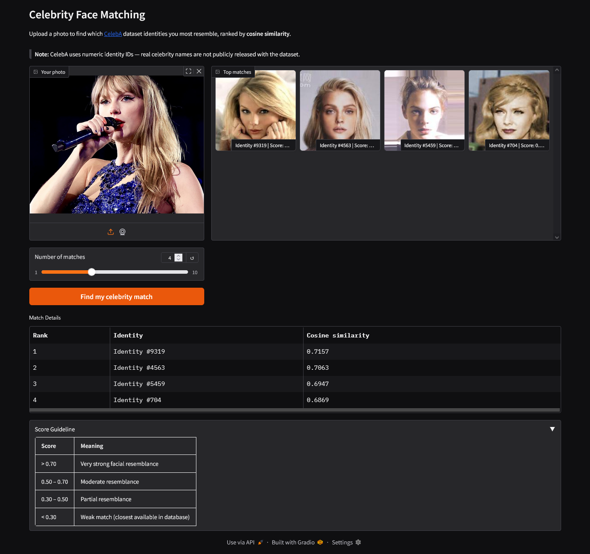

# Celebrity Face Matching

A computer vision app that takes in photo as input and find which celebrity in [CelebA dataset](http://mmlab.ie.cuhk.edu.hk/projects/CelebA.html) dataset that you most resemble using face embeddings and nearest-neighbor search. It is built with facenet-pytorch and FAISS. User interface is a Gradio web app.


## Demo



For a live demo, you can have a look at this [HuggingFace page](https://huggingface.co/spaces/aliauw/celebrity-face-matching).

## How It Works

### Phase 1 — Offline Index Building (`embed.py`)
Runs once locally to build the searchable database:

1. Load the **CelebA dataset** (202,599 celebrity images)
2. Standardize each image to 160×160 PIL format
3. Detect and align faces using **MTCNN**
4. Generate a 512-dim embedding per face using **InceptionResnetV1** (VGGFace2 pretrained) 
5. **L2-normalize** all embeddings (enables cosine similarity)
6. Build a **FAISS `IndexFlatIP`** index and save to disk

### Phase 2 — Online Inference (`app.py`)
Runs for each uploaded photo:

1. Detect and align face using MTCNN
2. Generate 512-dim embedding via InceptionResnetV1
3. L2-normalize and search the FAISS index for top-k nearest neighbors
4. Filter duplicate results by identity and return ranked matches with similarity scores

## File Breakdown

| File | Role |
|---|---|
| `app.py` | Gradio web app handling inference and UI |
| `embed.py` | Initial pipeline building FAISS index from CelebA |
| `celeba_face_index.faiss` | Pre-built FAISS search index |
| `celeba_identities.npy` | Maps FAISS positions to CelebA identity IDs |
| `identity.txt` | Maps image filenames to identity IDs (same with CelebA `identity_CelebA.txt`) |
| `requirements.txt` | Dependencies |

## Tech Stack

- **[facenet-pytorch](https://github.com/timesler/facenet-pytorch)** - MTCNN face detection + InceptionResnetV1 embeddings
- **[FAISS](https://github.com/facebookresearch/faiss)** - exact nearest-neighbor search
- **[Gradio](https://gradio.app)** - web UI
- **[CelebA dataset](http://mmlab.ie.cuhk.edu.hk/projects/CelebA.html)** - 202k celebrity face images

## Notes

- CelebA uses numeric identity IDs as real celebrity names are not publicly released with the dataset
- Embeddings are 512-dimensional, L2-normalized with similarity scores range from 0 (no match) to 1 (identical)
- Index building (embed.py) takes 2-3 hours on a consumer GPU in my own experience. It will be unfeasible for CPU. Inference runs fine on CPU.

## Local Setup

### Prerequisites

- CUDA-capable GPU recommended (required for index building, optional for inference)
- 3+ GB disk space for the CelebA dataset and generated index files

### 1. Install dependencies
```bash
pip install -r requirements.txt
```

### 2. Build the index (requires CelebA dataset)
```bash
python embed.py
```

CelebA will auto-download via torchvision on the first run. If the download fails (common due to Google Drive quotas), download manually from [the official page](http://mmlab.ie.cuhk.edu.hk/projects/CelebA.html) and place the files in `./data/celeba/`.

### 3. Run the app
```bash
python app.py
```

## Design Decisions
 
- **Two-model pipeline (MTCNN + InceptionResnetV1)**: Face recognition requires two distinct tasks — locating/aligning a face in an arbitrary image, and extracting an identity-capturing embedding from that aligned face. MTCNN handles the first (detection and alignment to a standardized 160×160 crop), and InceptionResnetV1 handles the second (producing a 512-dim embedding). Feeding raw, uncropped images directly into the embedding model would produce noisy vectors polluted by background, hair, and clothing.
 
- **VGGFace2 pretrained weights**: facenet-pytorch offers two pretrained options — VGGFace2 and CASIA-WebFace. VGGFace2 was chosen for its larger scale (~3.3M images, 9k+ identities) and greater diversity in pose, age, lighting, and ethnicity, which produces embeddings that generalize better to the varied conditions of user-uploaded photos.
 
- **Offline/online split**: Index building is expensive (2-3 hours on GPU, 200k images) but only needs to run once. Separating it into `embed.py` keeps the inference app (`app.py`) lightweight and fast — it loads the pre-built index at startup and searches are near-instant.
 
- **L2 normalization + IndexFlatIP**: L2-normalizing all embeddings to unit length makes inner product (dot product) mathematically equivalent to cosine similarity. This lets us use FAISS's `IndexFlatIP` for fast, exact cosine similarity search without needing a dedicated cosine index.
 
- **FAISS exact search (IndexFlatIP)**: At ~200k embeddings of 512 dimensions, exact brute-force search is fast enough (sub-second). Approximate methods like IndexIVFFlat add complexity (training, tuning nprobe) with minimal latency benefit at this scale.
 
- **Deduplication by identity**: CelebA contains ~20 images per identity on average. Without deduplication, a top-4 search could return four different photos of the same person. The app over-fetches from FAISS and filters by identity ID, keeping only the highest-scoring hit per person.

## Potential Improvements
 
- **Named celebrity mapping**: CelebA only provides numeric identity IDs — real names are not included in the public dataset. Mapping IDs to actual celebrity names (via a community-maintained list or manual annotation) would make results more meaningful to users.
 
- **Dynamic representative images**: Currently, the gallery thumbnail for each identity is a fixed representative image (the first listed in `identity.txt`), regardless of which specific photo scored highest in the search. Storing a FAISS position-to-filename mapping would allow showing the actual best-matching image instead.
 
- **Approximate nearest-neighbor search**: The current `IndexFlatIP` performs exact brute-force search, which is fine at 200k embeddings. At larger scales (millions+), switching to an approximate index like `IndexIVFFlat` or `IndexHNSW` would keep search times low at the cost of a small accuracy tradeoff.
 
- **Double detection (resolved)**: An earlier version of the app ran face detection twice per query — once via `mtcnn.detect()` for bounding boxes and again via `mtcnn()` for aligned face tensors. This was refactored to call `mtcnn.detect()` once and pass the boxes to `mtcnn.extract()`, eliminating the redundant work.
